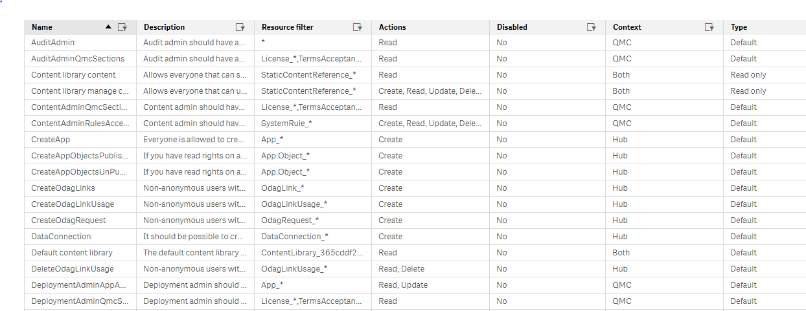
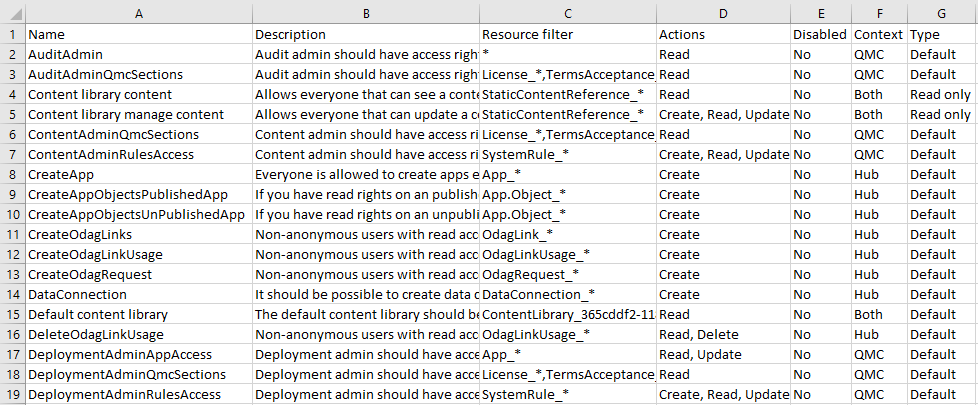

# Export Qlik QMC table as csv

Small `Chrome` / `Edge (Chromium)` extension that can export `Qlik Sense` management console (`QMC`) tables to csv file OR copy the csv string to the clipboard

For example the following table in QMC:

Will be exported as:

## Status

As far as I can see it's working. More tests have to be performed.

## Qlik Version

Tested with versions:

- `Qlik Sense November 2018`
- `Qlik Sense June 2020`

## Browser permissions

The extension is set to have access only to:

- `activeTab` - the currently active tab
- `https://*/qmc/*` and `https://*/*/qmc/*` - all URLs matching these patterns. In general only the QMC link (or QMC link with virtual proxy prefix)

## Store links

Install the extension from the official stores:

- [Chrome Web Store](https://chrome.google.com/webstore/detail/export-qlik-sense-qmc-tab/dbnjjihpapafmihpnionckfipbmalhko)
- [Edge (Chromium) Add-ons Store](https://microsoftedge.microsoft.com/addons/detail/export-qlik-sense-qmc-tab/blejofjglpgmigmclppeokgfaknefnek)
